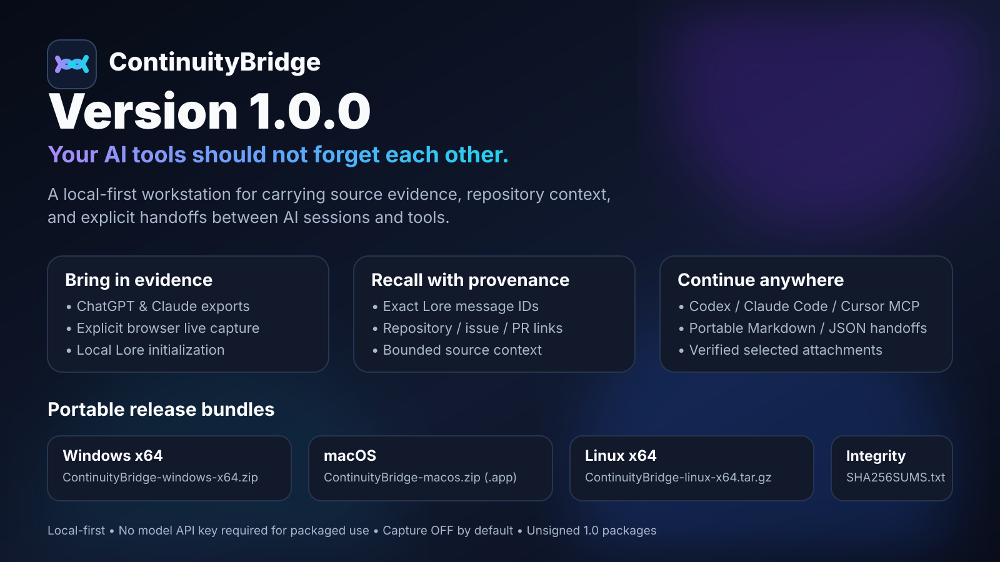

<p align="center">
  
</p>

<h1 align="center">ContinuityBridge</h1>

<p align="center"><strong>Your AI tools should not forget each other.</strong></p>

<p align="center">
  Local-first continuity for carrying user-authorized conversation evidence, repository context,
  and bounded handoffs between AI sessions and tools.
</p>

<p align="center">
  <a href="https://github.com/acrinym/ContinuityBridge/releases/tag/v1.0.0"><strong>Download 1.0.0</strong></a>
  · <a href="docs/GETTING-STARTED.md">Getting started</a>
  · <a href="docs/USER-GUIDE.md">User guide</a>
  · <a href="RELEASE_NOTES.md">Release notes</a>
  · <a href="docs/PRIVACY.md">Privacy</a>
</p>



## What ContinuityBridge is

ContinuityBridge 1.0 is one workstation for this journey:

```text
ChatGPT / Claude exports ─┐
                         ├──▶ History / Capture
explicit browser capture ┘          │
                                    ▼
                              local Lore evidence
                                    │
                         ┌──────────┴──────────┐
                         ▼                     ▼
                    Recall source        repository links
                         │                     │
                         └──────────┬──────────┘
                                    ▼
                              Continue / handoff
                                    │
                         ┌──────────┼──────────┐
                         ▼          ▼          ▼
                       Codex   Claude Code   Cursor
```

It can:

- import supported **ChatGPT** and **Claude** exports;
- explicitly capture recognized visible ChatGPT/Claude browser conversations;
- recall exact source evidence through Lore;
- link evidence to repository, issue, and pull-request coordinates;
- preview and explicitly configure Lore MCP for supported AI clients;
- build Markdown/JSON continuation packages with bounded evidence and optional verified local artifacts.

**Packaged 1.0 releases include the ContinuityBridge engine, a platform Node.js runtime, pinned Lore runtime, `ContinuityBridgeLore`, and the browser capture companion. Packaged users do not need a model API key, API credits, source checkout, global Node installation, or global Lore npm installation.**

## Download

The `v1.0.0` release publishes:

| Platform | File |
| --- | --- |
| Windows x64 | `ContinuityBridge-windows-x64.zip` |
| macOS | `ContinuityBridge-macos.zip` containing `ContinuityBridge.app` |
| Linux x64 | `ContinuityBridge-linux-x64.tar.gz` |
| Integrity | `SHA256SUMS.txt` |

Start with **[Getting started](docs/GETTING-STARTED.md)** for checksum verification, extraction, unsigned-package warnings, and first run.

> **1.0 signing status:** the Windows/macOS packages are currently unsigned / not notarized. SmartScreen or Gatekeeper may show the platform's normal warning for an internet-downloaded unsigned app. Use the OS's normal per-application review/allow path rather than disabling security globally.

A standalone release page also lives at [`docs/release/index.html`](docs/release/index.html).

## The Workstation

### Home

Checks the ContinuityBridge runtime, Lore, optional Git support, and supported AI-client connection state. Packaged builds offer **Initialize local memory** as an explicit action.

### History

Analyze and import supported ChatGPT/Claude exports. Repeated imports use destination-aware checkpoints so unchanged conversations can be skipped safely.

### Recall

Search Lore, inspect bounded surrounding source context, and work with real source/session/message identifiers.

Repository-aware Recall can explicitly associate evidence with a Git repository and optional issue / pull-request coordinates without copying conversation content into a second database.

### Connections

Detect supported installed **Codex**, **Claude Code**, and **Cursor** clients. Preview the exact Lore MCP configuration and apply it only after explicit confirmation.

### Capture

Capture is explicit and local:

- **OFF by default**;
- authenticated receiver bound to `127.0.0.1`;
- fresh per-run bearer token;
- browser extraction only after **Capture current conversation** is clicked;
- recognized visible ChatGPT/Claude message structures only;
- unsupported page structures are refused rather than guessed;
- unchanged repeated captures use the same incremental checkpoint machinery as history refresh.

There is no background page observer, LAN listener, or provider-private API client.

### Continue

Build portable continuation packages from a task plus exact Lore evidence. Packages can include repository state, issue/PR coordinates, and explicitly selected local artifacts copied into a SHA-256-verified bundle.

**Preview is non-mutating.** Artifact files are copied only on explicit Build.

## Documentation for everyone

### Using the product

- [Getting started](docs/GETTING-STARTED.md)
- [User guide](docs/USER-GUIDE.md)
- [Troubleshooting](docs/TROUBLESHOOTING.md)
- [Privacy model](docs/PRIVACY.md)

### Building / extending it

- [Documentation index](docs/README.md)
- [Architecture](docs/ARCHITECTURE.md)
- [Workstation design](docs/WORKSTATION.md)
- [Contributing](CONTRIBUTING.md)
- [Security](SECURITY.md)

### Maintaining / releasing it

- [Release notes](RELEASE_NOTES.md)
- [Release procedure](docs/RELEASING.md)
- [Changelog](CHANGELOG.md)
- [Roadmap](docs/ROADMAP.md)

Historical `docs/TRAIN-*.md` files remain implementation receipts; normal users do not need them.

## CLI workflows

Source/automation users retain the public CLI.

History:

```bash
continuity-bridge inspect-chatgpt ./chatgpt-export.zip --json
continuity-bridge inspect-claude ./claude-export.zip --json
continuity-bridge import-chatgpt ./chatgpt-export.zip --to-lore
continuity-bridge import-claude ./claude-export.zip --to-lore
```

Live capture:

```bash
continuity-bridge capture inspect ./capture.json --json
continuity-bridge capture submit ./capture.json --to-lore
continuity-bridge capture serve --to-lore --port 43119
```

Evidence-backed handoff:

```bash
continuity-bridge handoff \
  --task "Continue implementation" \
  --query "the product decision we made" \
  --repo . \
  --issue '#42' \
  --pull-request '#88' \
  --output ./HANDOFF.md
```

## Source development

Packaged users do **not** need this.

```bash
git clone https://github.com/acrinym/ContinuityBridge.git
cd ContinuityBridge
npm install
pip install ./desktop
```

Lore-dependent source development uses the same pinned source revision as the packaged 1.0 release:

```bash
cd ..
git clone https://github.com/jordanhindo/lore.git
cd lore
git checkout 7d10369ef265fb73e539223235979ef2f367bdb8
npm ci
npm run build
npm link
```

Then:

```bash
cd ../ContinuityBridge
npm run check
npm run smoke
npm run check:desktop
continuity-bridge-desktop
```

See [CONTRIBUTING.md](CONTRIBUTING.md) for the full development contract.

## Privacy and data ownership

ContinuityBridge is local-first by design:

- no hosted ContinuityBridge account is required;
- exports are not uploaded to a ContinuityBridge server;
- Lore data remains under `~/.lore/` by default or configured `LORE_DB`;
- ContinuityBridge state remains under `~/.continuity-bridge/`;
- local-memory initialization is explicit;
- AI-client configuration changes require explicit confirmation;
- live capture is loopback-only and bearer-authenticated;
- browser capture happens only after an explicit click;
- captured source URLs lose credentials, query strings, and fragments;
- credential-like message text is redacted by default;
- provider-private attachment pointers are suppressed;
- attachment copying requires explicit selection.

Read [`docs/PRIVACY.md`](docs/PRIVACY.md) and [`SECURITY.md`](SECURITY.md).

## Update and uninstall

Close ContinuityBridge, replace the old extracted application folder / `.app` with the newer release, and launch again.

The application bundle is replaceable. It does not silently delete:

- `~/.lore/` or configured `LORE_DB`;
- `~/.continuity-bridge/`;
- handoff bundles saved elsewhere.

Delete those separately only when you intentionally want to remove the associated data.

## License

MIT. See [LICENSE](LICENSE) and [NOTICE](NOTICE).
